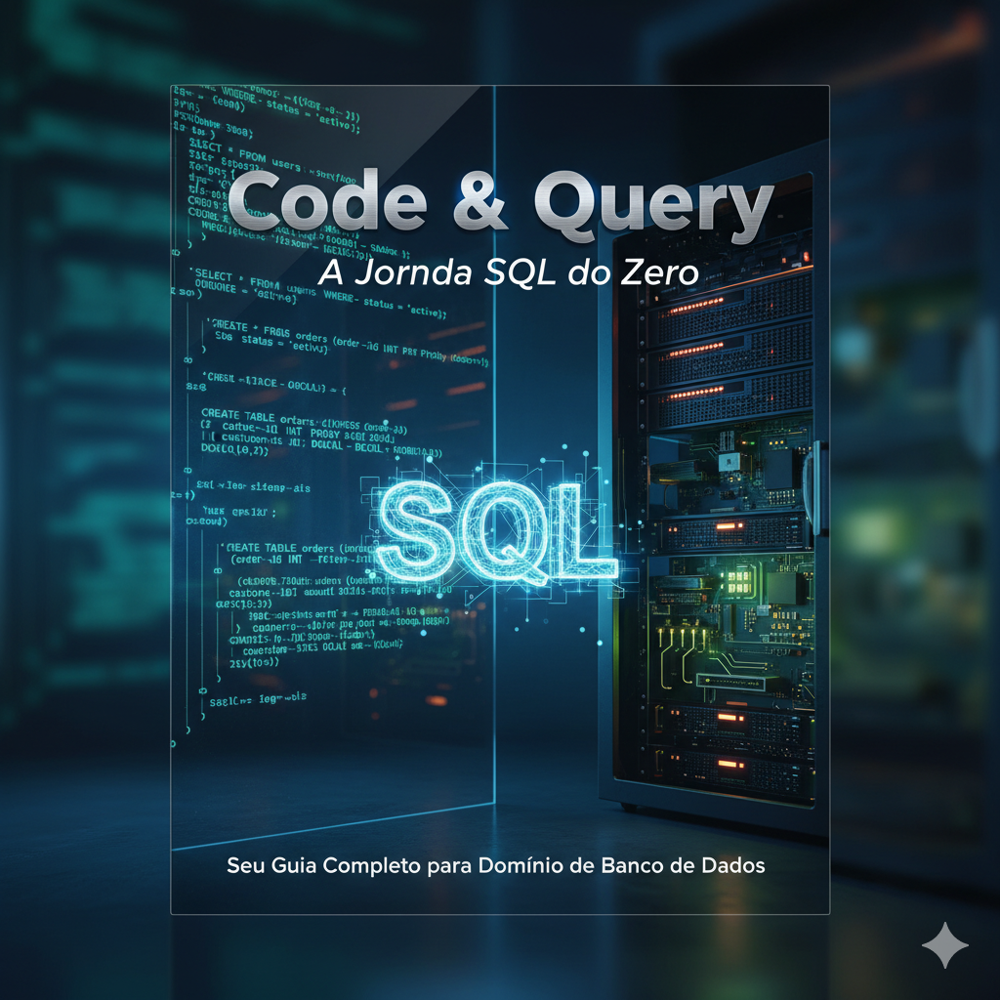

## 📘 Code & Query – A Jornada SQL do Zero

Bem-vindo ao repositório oficial do eBook Code & Query – A Jornada SQL do Zero, um guia criado para ajudar iniciantes a aprender SQL de forma simples, objetiva e prática.

Este material apresenta desde os conceitos fundamentais de bancos de dados até comandos essenciais como SELECT, WHERE, JOIN, INSERT, UPDATE e muito mais — tudo explicado de maneira clara e acessível.

<a href="https://github.com/Augusto-Belussi/Ebook_SQL_IA/blob/main/output/ebook%20-%20Code%20%26%20Query%20.pdf" title="View PDF now"> 📕Clique aqui para ler</a>

## 📖 Sobre o eBook

O eBook foi desenvolvido com o objetivo de ensinar SQL do zero, mesmo para quem nunca teve contato com bancos de dados.
Aqui você aprenderá:

O que é SQL e por que ele é tão importante

Como funcionam bancos de dados relacionais

Estruturas como tabelas, colunas e registros

Como consultar informações com SELECT

Como filtrar, ordenar e analisar dados

Criar tabelas, inserir, atualizar e deletar registros

Noções básicas sobre JOINs e funções de agregação

O conteúdo é ideal para estudantes, iniciantes em programação, desenvolvedores júnior e todos que desejam entrar no universo dos dados.

## 🧠 Para quem este eBook é indicado?

• Pessoas iniciando na área de tecnologia

• Estudantes de programação ou ciência da computação

• Profissionais que querem aprender SQL do zero

• Quem deseja melhorar seu currículo com uma habilidade muito procurada

• Curiousos que querem entender como dados funcionam

## 📌 Conteúdos Abordados

• Introdução ao SQL

• Estrutura de um banco de dados

• Criar tabelas e inserir dados

• Consultas básicas e avançadas

• Filtros e ordenações

• Funções (COUNT, SUM, AVG, etc.)

• JOINs para unir tabelas

• Boas práticas para iniciantes

## 📚 Materiais

- Imagens utilizadas em `assets`
- ebook gerado em `output`

## 💻 Tecnologias utilizadas no projeto

- [ChatGPT](https://chat.openai.com/) 
- [Gemini](https://gemini.google.com/app?hl=pt-BR)
- [PowerPoint](https://www.microsoft.com/en/microsoft-365/powerpoint)

## 🚀 Sobre o Autor

Criado por Augusto Belussi

[GitHub](https://github.com/Augusto-Belussi) | [LinkedIn](https://www.linkedin.com/in/augustobelussi) | [Instagram](https://www.instagram.com/augusto_belussi)
